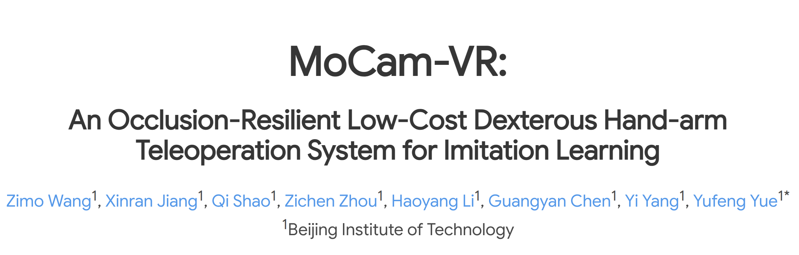

<div align="center">
<p>
        🌐 <a href="https://wzimo6.github.io/MoCam-VR/">Website</a>&nbsp&nbsp | ⚙️ <a href="https://wzimo6.github.io/MoCam-VR/">Hardware</a>
</p>
</div>

---

## **✨ Updates**

* 🌟 *2025.11.15*: Initial open-source release of **MoCam-VR**, including three major modules ([`src/human_hand_detector`](src/human_hand_detector) [`src/leap_hand_retargeting`](src/leap_hand_retargeting) [`src/rviz_visualizer`](src/rviz_visualizer)).

---

## **📘 Introduction**

We introduce **MoCam-VR**, a low-cost, occlusion-resilient teleoperation system for dexterous hand–arm manipulation.
MoCam-VR employs a dynamic multi-camera configuration that maintains optimal hand visibility during manipulation, significantly reducing finger occlusion and expanding the effective motion range.

By integrating real-time multi-view rendering into VR, the system ensures accurate perception and teleoperation even in complex environments. Properly configured camera viewpoints enable natural human–robot mapping with **zero calibration**, allowing seamless teleoperation whether the user approaches the robot from the front, back, or side.

Built using off-the-shelf components and 3D-printed parts, MoCam-VR achieves performance comparable to commercial motion capture systems while remaining affordable and easy to reproduce.

<p align="center">
    <video controls width="480">
      <source src="assets/MoCamVR.mp4" type="video/mp4">
    </video>
<p>

---

# **🚀 Quick Start Guide (Docker)**

This guide walks you through running the entire MoCam-VR system using Docker and ROS 2 Humble.

---

## **1️⃣ Clone the repository**

```bash
git clone https://github.com/WZimo6/MoCam_VR_Code.git
```

---

## **2️⃣ Build the Docker image**

The Dockerfile installs all ROS2 + vision dependencies for dexterous-hand teleoperation.

### Optional: speed up PyPI access (for users in China)

Add this line before `pip install` in the [Dockerfile](docker/Dockerfile):

```dockerfile
RUN pip config set global.index-url https://pypi.tuna.tsinghua.edu.cn/simple
```

### Build the image

```bash
cd MoCam_VR_Code
./docker/build.sh
```

---

## **3️⃣ Launch the development container**

> **❗ Must be executed inside `MoCam_VR_Code/`**

```bash
./docker/run.sh
```

---

## **4️⃣ Enter the container**

```bash
docker exec -it mocam_container bash
```

---

## **5️⃣ Build the ROS 2 workspace**

```bash
source /opt/ros/humble/setup.bash
colcon build --symlink-install
source install/setup.bash
```

---

# **🖐️ Hand Perception Modules**

## **6️⃣ Hand Keypoint Detection**

```bash
source install/setup.bash
# Choose one:
ros2 run human_hand_detector hand_keypoint_publisher right

ros2 run human_hand_detector hand_keypoint_publisher left
```

---

## **7️⃣ Hand Retargeting**

```bash
source install/setup.bash
# Choose one:
ros2 run leap_hand_retargeting hand_keypoint_retargeter right

ros2 run leap_hand_retargeting hand_keypoint_retargeter left
```

---

## **8️⃣ Visualization in RViz2**

```bash
source install/setup.bash
# Choose one:
ros2 launch rviz_visualizer visualize_leap_right.launch.py

ros2 launch rviz_visualizer visualize_leap_left.launch.py
```

---

# **📦 System Modules**

| Module                    | Description                                               |
| ------------------------- | --------------------------------------------------------- |
| **human_hand_detector**   | Real-time 3D hand keypoint extraction                     |
| **leap_hand_retargeting** | Mapping human finger motion to robotic hand configuration |
| **rviz_visualizer**       | ROS2 visualization for debugging and evaluation           |

---

# **📜 Citation**

If our work is helpful for your research, please cite:

```bibtex

```
